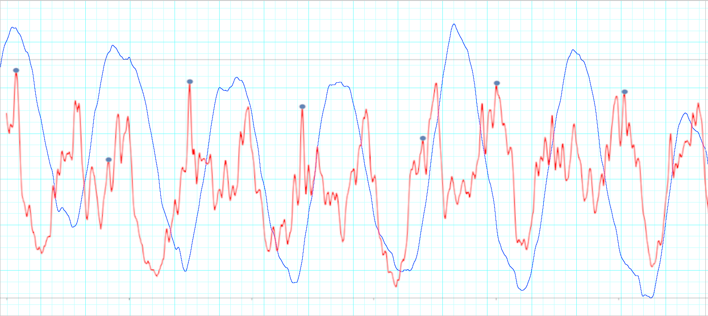

# dvResp

**dvResp** is a research-oriented repository for non-contact respiration rate monitoring using **neuromorphic vision**. It is based on the methods developed in the following papers:

- **Huhs, N., Kalashtari, M.**  
  *Non-Contact Monitoring of Respiration and Heart Rate Using Neuromorphic Cameras in AAL Settings*  
  *(LiDAR section omitted in this repository)*

- **Huhs, N., Kalashtari, N., Kraitl, J., Hornberger, C., Simanski, O.**  
  *Non-invasive vital parameter detection using neuromorphic cameras*.  
  Published in: *Current Directions in Biomedical Engineering (CDBME)*, 2024.  
  [View on ResearchGate](https://www.researchgate.net/publication/387159959_Non-invasive_vital_parameter_detection_using_neuromorphic_cameras)

---

## Overview

This repository implements signal processing pipelines for extracting **respiration rate** from **event-based data** captured by the **DVXplorer neuromorphic camera** by [iniVation](https://inivation.com/). The system captures minute chest and neck movements that correlate with the breathing cycle, making it suitable for **privacy-preserving**, **non-invasive**, and **continuous monitoring** in **Ambient Assisted Living (AAL)** environments.

### Key Features

- Contact-free measurement of respiration rate
- Robust under varying lighting and background conditions
- Event-based camera input (asynchronous neuromorphic data)
- Filtering and signal extraction pipeline using Python

---

## Example: Respiration Signal Detection

The figure below shows an example of a respiration signal detected from the neuromorphic camera data. The red line represents the processed event signal, while the blue line shows the ground truth reference from a respiration belt system.



---

## Hardware Requirements

- **DVXplorer camera** (Inivation AG)
- Tripod or fixed mount to align camera with upper torso
- Optional: **PowerLab 15T** with respiration belt for ground truth validation

---

## Signal Processing Pipeline

1. Event data recorded with the DVXplorer camera
2. Region of interest (ROI) focused on chest and neck
3. Events binned into time slices (10 ms)
4. Bandpass filtering (0.08–0.7 Hz for respiration)
5. Peak detection to estimate breathing cycles
6. Output: respiration rate in breaths per minute (bpm)

---

## Citation

If you use this repository in academic or commercial work, please cite:

```bibtex
@article{huhs2024aal,
  title={Non-Contact Monitoring of Respiration and Heart Rate Using Neuromorphic Cameras in AAL Settings},
  author={Huhs, Niklas and Kalashtari, Niloofar},
  journal={Special Issue on Smart Healthcare, Ambient Intelligence, and Assistive Technologies},
  year={2024}
}

@inproceedings{huhs2024vital,
  title={Non-invasive vital parameter detection using neuromorphic cameras},
  author={Huhs, Niklas and Kalashtari, Niloofar and Kraitl, Jens and Hornberger, Christoph and Simanski, Olaf},
  booktitle={Current Directions in Biomedical Engineering},
  year={2024},
  url={https://www.researchgate.net/publication/387159959_Non-invasive_vital_parameter_detection_using_neuromorphic_cameras}
}
